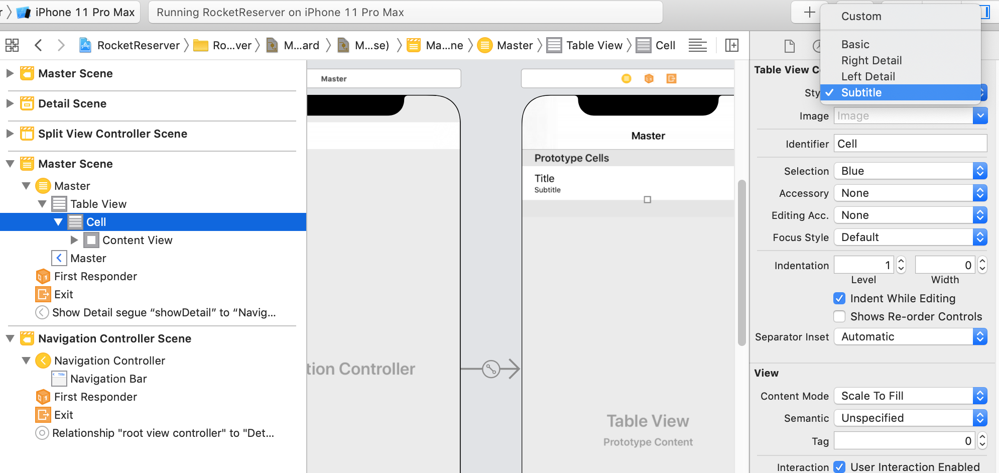
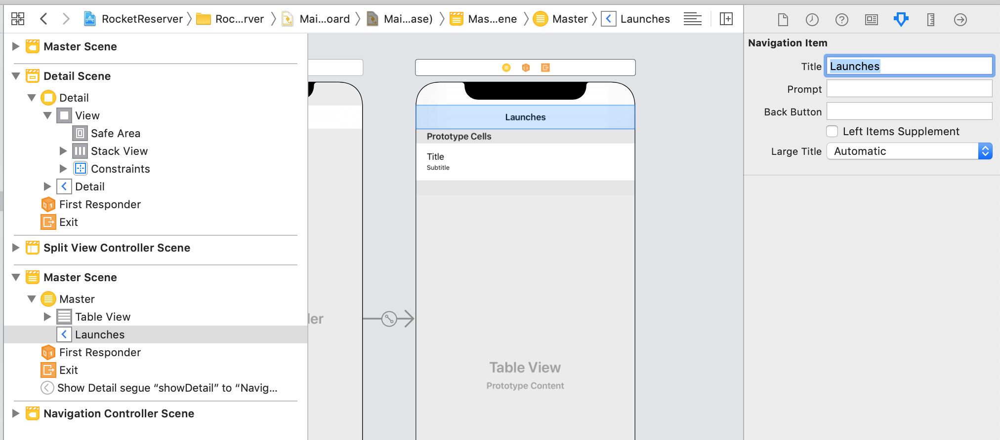

In the first part of this tutorial, you got everything set set up to allow you to communicate with the server. Now, it's time to power your UI with the result of those queries!

In **MasterViewController.swift**, delete the following pieces of boilerplate you're not going to need (in top to bottom of the file order): 

- The `objects` property
- Everything in `viewDidLoad` except the `super.viewDidLoad()` call.
- The entire `insertNewObject()` method.
- The contents of `prepareForSegue()` (but not the method itself)
- The entire `tableView(_, canEditRowAt:)` method.
- The entire `tableView(_, commit:, forRowAt:)` method.

Next, at the top of the file, add a new property to store the loaded launches: 

```swift
var launches = [LaunchListQuery.Data.Launch.Launch]()
```

Why the long name? Each query returns its own nested objects to ensure that when you use the result of a particular query, you can't ask for 

Add an enum to handle dealing with sections: 

```swift
enum ListSection: Int, CaseIterable {
  case launches
}
```

Add the `UITableViewDataSource` methods: 

```swift
override func numberOfSections(in tableView: UITableView) -> Int {
  return ListSection.allCases.count
}
```

```swift
override func tableView(_ tableView: UITableView, numberOfRowsInSection section: Int) -> Int {
  guard let listSection = ListSection(rawValue: section) else {
    assertionFailure("Invalid section")
    return 0
  }
        
  switch listSection {
  case .launches:
    return self.launches.count
  }
}
```


```swift
override func tableView(_ tableView: UITableView, cellForRowAt indexPath: IndexPath) -> UITableViewCell {
  let cell = tableView.dequeueReusableCell(withIdentifier: "Cell", for: indexPath)

  guard let listSection = ListSection(rawValue: indexPath.section) else {
    assertionFailure("Invalid section")
    return cell
  }
    
  switch listSection {
  case .launches:
    let launch = self.launches[indexPath.row]
    cell.textLabel?.text = launch.site
  }
    
  return cell
}
```


Add a method to handle showing errors: 

```swift
private func showErrorAlert(title: String, message: String) {
  let alert = UIAlertController(title: title,
                                message: message,
                                preferredStyle: .alert)
  self.present(alert, animated: true)
}
```

Add a method to load the launches:

```swift
private func loadLaunches() {
  Network.shared.apollo
    .fetch(query: LaunchListQuery()) { [weak self] result in
    
      guard let self = self else {
        return
      }

      defer {
        self.tableView.reloadData()
      }
            
      switch result {
      case .success(let graphQLResult):
        // TODO
      case .failure(let error):
        self.showErrorAlert(title: "Network Error",
                            message: error.localizedDescription)
      }
}
```


`GraphQLResult` has both `data` property and an `errors` property. This is because GraphQL is designed to allow partial data to be returned if it's not non-null. 

In the example we're working with now, we could theoretically get a list of launches, and then an error stating that a launch with a particular ID could not be constructed. 

Replace the `// TODO` with:

```swift
if let launchConnection = graphQLResult.data?.launches {
  self.launches.append(contentsOf: launchConnection.launches.compactMap { $0 })
}
        
if let errors = graphQLResult.errors {
  let message = errors
        .map { $0.localizedDescription }
        .joined(separator: "\n")
  self.showErrorAlert(title: "GraphQL Error(s)",
                      message: message)    
}
```

Finally, you'll need to kick off the whole process by actually making the call to the network when the view is first loaded. Update your `viewDidLoad` to also call `loadLaunches`: 


```swift
override func viewDidLoad() {
  super.viewDidLoad()
  self.loadLaunches()
}
```


Build and run the application. 

// TODO: Initial Screenshot


## Passing information to the Detail view

In **DetailViewController.swift**, first delete the `detailItem` property at the bottom of the class, since you're not going to be using it. Next, add a new property at the top of the class:  

```swift
var launchID: GraphQLID? {
  didSet {
    self.configureView()
  }
}
```

Update the `configureView()` method to use this new property instead of the `detailItem` property you just deleted: 

```swift
func configureView() {
  // Update the user interface for the detail item.
  guard
    let label = self.detailDescriptionLabel,
    let id = self.launchID else {
      return
  }

  label.text = "Launch \(id)"
}
```

Next, back in **MasterViewController.swift**, update the `prepareForSegue` method to show the 

```swift
override func prepare(for segue: UIStoryboardSegue, sender: Any?) {
  guard let selectedIndexPath = self.tableView.indexPathForSelectedRow else {
    // Nothing is selected, nothing to do
    return
  }
    
  guard let listSection = ListSection(rawValue: selectedIndexPath.section) else {
    assertionFailure("Invalid section")
    return
  }
    
  switch listSection {
  case .launches:
    guard
      let destination = segue.destination as? UINavigationController,
      let detail = destination.topViewController as? DetailViewController else {
        assertionFailure("Wrong kind of destination")
        return
    }
    
    let launch = self.launches[selectedIndexPath.row]
    detail.launchID = launch.id
    self.detailViewController = detail
  }
}
```

One last thing: In **SceneDelegate.swift**, there was one spot that relied on the `detailItem` property you deleted earlier, which will cause an error . Follow the error to this spot, and replace the erroring line with:

```swift
if topAsDetailController.launchID == nil {
```

Build and run, and tap on any of the launches. You'll now see the launch ID for the selected launch when you land on the page!

// TODO: Screenshot of launch ID being passed in. 

## Adding more info to the list

The app is working! However, it's pretty ugly, and doesn't give you a ton of useful information. It's time to spiff it up a bit in order to get more information out of it. 

First, take advantage of one of the built-in styles for `UITableViewCell` to display more information without having to do much work. Go to **Main.storyboard**, select the **Master Scene** which includes the TableView and the default cell. 

Open the flippy triangles in the left sidebar of interface builder until you get to **Cell**. Select that element, then go to the **Attributes Inspector** in the right sidebar of Xcode. At the top, there's a drop-down which will allow you to select a style for your table view cell. Select **Subtitle**:



Also, while you're here, this is a good time to give the main TableView a name that better reflects what it's actually showing. Select the navigation item and rename it from `Master` to `Launches`:



```graphql
query LaunchList {
  launches {
    hasMore
    cursor
    launches {
      id
      site
      mission {
        name
        missionPatch(size: SMALL)
      }
    }
  }
}
```

[`https://github.com/SDWebImage/SDWebImage.git`](https://github.com/SDWebImage/SDWebImage.git)

```swift
import SDWebImage
```


```swift
override func tableView(_ tableView: UITableView, numberOfRowsInSection section: Int) -> Int {
  guard let listSection = ListSection(rawValue: section) else {
    assertionFailure("Invalid section")
    return 0
  }
        
  switch listSection {
  case .launches:
    return self.launches.count
}
```


```swift
cell.imageView?.image = nil
cell.textLabel?.text = nil
cell.detailTextLabel?.text = nil
```
    
```swift 
switch listSection {
case .launches:
  let launch = self.launches[indexPath.row]
  cell.textLabel?.text = launch.mission?.name
  cell.detailTextLabel?.text = launch.site
    
  let placeholder = UIImage(named: "placeholder")!
    
  if let missionPatch = launch.mission?.missionPatch {
    cell.imageView?.sd_setImage(with: URL(string: missionPatch)!, placeholderImage: placeholder)
  } else {
    cell.imageView?.image = placeholder
  }
}
```

## Getting more details for the detail page

```graphql
query LaunchDetails($id:ID!) {
  launch(id: $id) {
    id
    site
    rocket {
      name
    }
    mission {
      name
      missionPatch(size:LARGE)
    }
    isBooked
  }
}
```

Delete the `de

Add the following outlets:

```swift
@IBOutlet private var missionPatchImageView: UIImageView!
@IBOutlet private var missionNameLabel: UILabel!
@IBOutlet private var rocketNameLabel: UILabel!
@IBOutlet private var launchSiteLabel: UILabel!
@IBOutlet private var bookCancelButton: UIBarButtonItem!
```

The next section covers setting up constraints in detail to match the way things work in the sample application. You're welcome to use those five elements in an alternate setup if you'd prefer and skip the next section. 

### Setting up the Detail UI

In the end, your detail view controller should look like this in the storyboard: 


Delete the existing contents of `configureView()`. In their place, start by adding a check that we have something to display, and a place to display it:

```
guard
  self.missionNameLabel != nil,
  let launch = self.launch else {
    return
}
```   
    
Next, actually display all the informaton from 
   
```swift 
self.missionNameLabel.text = launch.mission?.name
self.title = launch.mission?.name

let placeholder = UIImage(named: "placeholder")!
    
if let missionPatch = launch.mission?.missionPatch {
  self.missionPatchImageView.sd_setImage(with: URL(string: missionPatch)!, placeholderImage: placeholder)
} else {
  self.missionPatchImageView.image = placeholder
}

if let site = launch.site {
  self.launchSiteLabel.text = "Launching from \(site)"
} else {
  self.launchSiteLabel.text = nil
}
    
if let rocketName = launch.rocket?.name {
  self.rocketNameLabel.text = "🚀 \(rocketName)"
} else {
  self.rocketNameLabel.text = nil
}
    
if launch.isBooked {
  self.bookButton.title = "Cancel trip"
  self.bookButton.tintColor = .red
} else {
  self.bookButton.title = "Book now!"
  self.bookButton.tintColor = self.view.tintColor
}
```


## Loading more launches

```swift
enum ListSection: Int, CaseIterable {
  case launches
  case loading
}
```


```swift
var lastConnection: LaunchListQuery.Data.Launch?
```


```swift
import Apollo
```

```swift
private var activeRequest: Cancellable?
```

Update `tableView(_:, numberOfRowsInSection:)`: 

```swift
case .loading:
if self.lastConnection?.hasMore == false {
    return 0
  } else {
    return 1
  }
}
```

Update `tableView(_, cellForRowAt:)`

```swift
case .loading:
  if self.activeRequest == nil {
    cell.textLabel?.text = "Tap to load more"
  } else {
    cell.textLabel?.text = "Loading..."
  }
}
    
return cell
}
```

```graphql
query LaunchList($cursor:String) {
  launches(after:$cursor) {
    hasMore
    cursor
    launches {
      id
      site
      mission {
        name
        missionPatch(size: SMALL)
      }
    }
  }
}
```


Add a new method:

```swift
private func loadMoreLaunchesIfTheyExist() {
  guard let detail = self.lastConnection else {
    // We don't have stored launch details, load from scratch
    self.loadMoreLaunches(from: nil)
    return
  }
    
  guard detail.hasMore else {
    // No more launches to fetch
    return
  }
    
  self.loadMoreLaunches(from: detail.cursor)
}
```

Update `loadLaunches()` to be `loadMoreLaunches(from cursor: String?)`: 

```swift
private func loadMoreLaunches(from cursor: String?) {
  self.activeRequest = Network.shared.apollo.fetch(query: LaunchListQuery(cursor: cursor)) { [weak self] result in
    guard let self = self else {
      return
    }
    
    self.activeRequest = nil
    defer {
      self.tableView.reloadData()
    }
    
    switch result {
    case .success(let graphQLResult):
      if let launchConnection = graphQLResult.data?.launches {
        self.lastConnection = launchConnection
        self.launches.append(contentsOf: launchConnection.launches.compactMap { $0 })
      }
    
      if let errors = graphQLResult.errors {
        let message = errors
                        .map { $0.localizedDescription }
                        .joined(separator: "\n")
        self.showErrorAlert(title: "GraphQL Error(s)",
                            message: message)
    }
    case .failure(let error):
      self.showErrorAlert(title: "Network Error",
                          message: error.localizedDescription)
    }
  }
}
```
